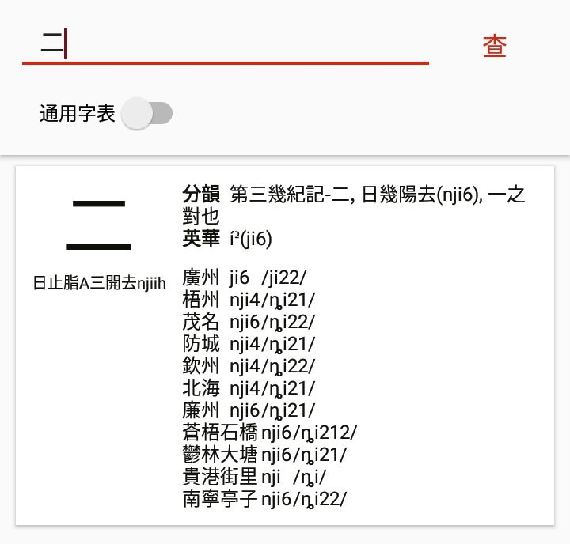
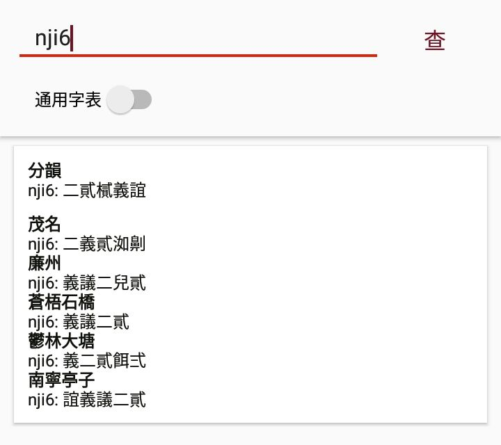
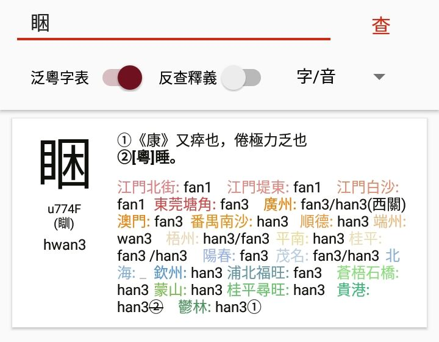
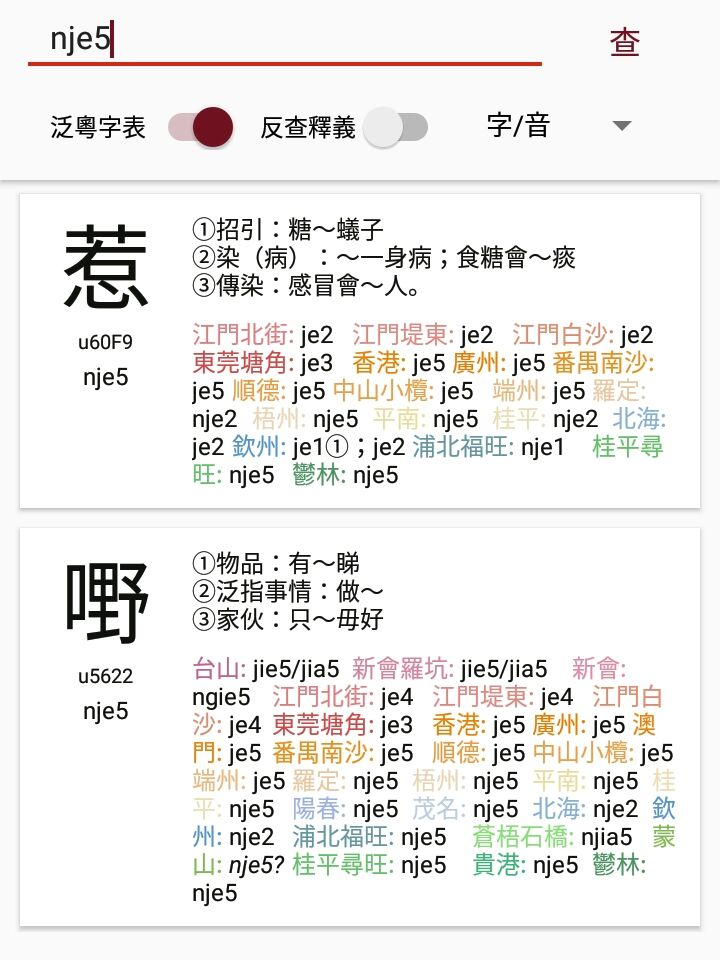
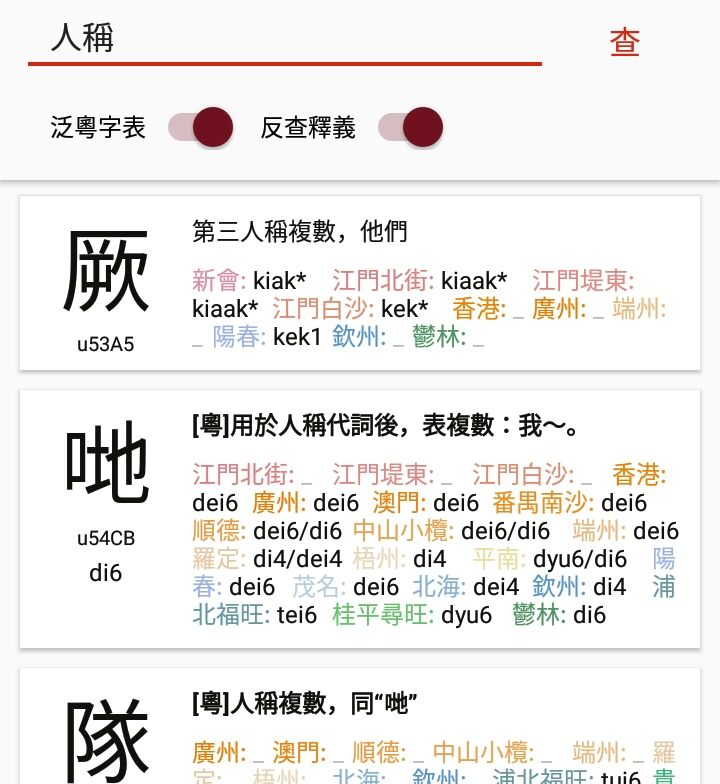

# Jyutdict Android

Current version: v0.6.7/230102

Update Description:

- Due to the contamination of our HTTP domain in Mainland China, HTTPS is now used across the board (the former use of HTTP is not relevant for upstream transmission)

This Android application is an [open source project](https://github.com/JyutdictEB/Jyutdict-Android), issues and stars are welcome.

**Download Links**

- [Lanzou Cloud](https://wwa.lanzoui.com/b010whhbe) (passcode: 7xg7)

- [Baidu Netdisk](https://pan.baidu.com/s/1r7mo35tEwZ0zAjQHIacf8w) (passcode: djms)

- [GitHub Releases](https://github.com/JyutdictEB/Jyutdict-Android/releases)

Below is an introduction to "Jyutdict Android".

## 1. Overview

Jyutdict aims to collect contemporary local pronunciations, historical rime book phonological positions and reconstructions, while providing basic lookup functionality including character lookup and pronunciation lookup. In the future, rime lookup (search by phonological position) and word lookup, along with more character tables, will be added.

This application is the Android terminal version of Jyutdict. Since the server data is continuously being updated and some data has not yet been granted full publication rights by the original authors, this app still requires an internet connection to query the server. The server is not located within Mainland China, so queries may be slow — your patience is appreciated.

Additionally, given the app's target audience, if you have limited exposure to Cantonese phonology (for instance, if you are seeking pathways to learn Cantonese), **this app may appear less than friendly**.

## 2. General Character Table & Pan-Cantonese Character Table

**This app uses the [Extended Jyutping](/en/j++/) romanisation scheme** (hereafter abbreviated as J++). The tone notation system is mostly illustrated in the [Pan-Cantonese Tone Chart](https://www.jyutdict.org/about#tone).

**The General Character Table (or "Common Speech Character Table")** collects characters shared between Cantonese and Mandarin, or those with a relatively broad usage range.

Compared with Xiaoxuetang, the local character tables and rime book data here are provided by scholars from various localities within the Lingnaam Jyutjam community (see the list at the bottom of this page). As such, the local pronunciations have largely been self-reviewed by these contributors with modern strata removed.

For ease of comparison, each character entry is accompanied by its [*Guangyun* phonological position](https://ytenx.org/kyonh/) and [Polyhedron's Middle Chinese romanisation](http://zh.wikipedia.org/wiki/User:Polyhedron/中古漢語拼音), represented in the same manner as the ["Chinese Character Pronunciations Across Time and Space"](https://zhuanlan.zhihu.com/p/20839947) app.

The upper-right portion of each character entry displays rime book readings: "分韻" refers to [*Fenyun Cuoyao* (Chidu edition)](https://ytenx.org/pyonh/), and "英華" refers to [*Yinghua Fenyun Cuoyao*](https://zh.wikipedia.org/wiki/英華分韻撮要)

In the local pronunciation table, the locality name is followed by J++ and corresponding [IPA](https://en.wikipedia.org/wiki/International_Phonetic_Alphabet) notation. A fourth column occasionally appears as remarks, typically example words or explanations for characters with multiple readings.

When searching the General Character Table, you can look up multiple characters simultaneously, with automatic simplified-to-traditional conversion. Note, however, that searching more than ten characters at once is not supported, and support for compatibility characters is poor.

You can also use J++ to look up homophones across localities by directly entering a pronunciation and searching.

Tone markers can be omitted to indicate "tone-insensitive" search.

------

**The Pan-Cantonese Character Table records characters that are more distinctively "Cantonese" compared to Mandarin**, using [Extended Jyutping (J++)](/en/j++/) to document their pronunciations across various localities. As of February 2021, over 3,000 entries had been collected.

While the table's definitions may not cover usages across all localities, and local records may be limited in precision by the contributors' knowledge, it at least allows these distinctive characters to be digitally preserved regardless of their status. It also helps roughly determine the usage range of a particular character and meaning. Conversely, local pronunciations can also provide more refined phonological information for the character head.

The image above shows the result of looking up "睏" in the Pan-Cantonese Character Table. From top to bottom on the left are: **the representative character**, Unicode, other character forms (such as folk variant characters, pseudo-etymological characters), and **the composite pronunciation**. The actual display order may differ from the description here.

- **The "representative character" does not represent the etymological character (本字) or the orthodox character (正字)**. It is simply a relatively reasonable character chosen based on sound and meaning. We neither excessively pursue etymological characters, nor resist using folk characters with mouth radicals, nor insist on them being suitable for everyday typing.

- **The "composite pronunciation" does not represent the standard pronunciation (正音)**, nor does it represent historical readings. Rather, it is an artificial phonological system that merges the most raised elements from each selected locality. The composite pronunciation may inevitably contain occasional errors, so please refer extensively to the pronunciations marked for individual localities.

Accordingly, **this app does not take any position requiring "standard pronunciation (正音)" or "orthodox characters (正字)"**.

The right side is divided into three parts: "Definition", "Local Pronunciations", and "Semantic Field":

- **When "Definition" contains bold text, only the bold portion should be attended to**; other senses are typically taken from the current character head's explanations in classical dictionaries or the common language and do not imply that a particular locality possesses that sense.

- The "Local Pronunciations" section colours each locality by default; colouring parameters can be adjusted in the settings interface. The closer the colours, the smaller the difference between the two localities, with hues roughly indicating subgroup affiliation. Pronunciations are likewise indicated in J++; italic text with a question mark "*?*" indicates uncertainty, while an underscore "_" indicates that the expression is considered unattested in that locality.

- "Semantic Field" indicates the category of the character's meaning; only some characters are tagged with this.

Unlike the General Character Table, this table currently allows searching only one character at a time and no longer supports automatic simplified-to-traditional conversion.

Similarly, you can use J++ to search by composite pronunciation, or specify a particular locality's pronunciation from the dropdown list.

**Note: Please do not equate the "composite pronunciation" with Guangzhou pronunciation or Hong Kong pronunciation.** The rules for constructing the composite pronunciation are as follows:

> **Onsets:**
>
> z c s / zh ch sh: Distinguishes the Jing (精) and Zhao (照) series (Jing i merges with Shi (师) rime ii, so it is not further marked)
>
> j / nj: Distinguishes the Ri (日) initial
>
> **Rimes:**
>
> aa / ae / e / i: *ae* is used wherever possible for Division II, depending on whether raising has occurred in places like Shunde; *e* in open-syllable rimes represents Xie (蟹) and Zhi (支) colloquial readings; *i / e* in checked-syllable (入声) rimes — see below
>
> o / oe: *oe* represents Guo (果) Division III closed in the phonological system, as well as Guo open colloquial readings, depending on specific literary-colloquial patterns
>
> ui / ooi / yi / yu: Distinguishes Kui (魁, ui), Sui (虽, ooi), Zhu (诸, yu) rimes; the split of the Jing series in Yu (遇, yi) depends on whether diphthongisation has occurred in each locality
>
> im in ing / em en eng: Division III/IV literary-colloquial readings, favouring colloquial readings where possible, also considering the literary-colloquial ratio across localities (same principle applies to entering-tone rimes)
>
> ing / yng: Geng (梗) and Zeng (曾) Division III/IV, depending on whether rounding has occurred in places like Watlam (same principle applies to entering-tone rimes)
>
> ong / owng: Dang (宕) and Jiang (江), depending on whether rounding has occurred in places like Watlam (same principle applies to entering-tone rimes)
>
> **Tones:**
>
> Entering tone 4 / 6: Upper and lower Yang entering (阳入), depending on vowel length, primarily with reference to Watlam

Since the local pronunciation data is filled in voluntarily by native speakers from each locality and current manpower is limited, missing entries or errors for a given locality are common. Those interested in helping may contact us via the information at the bottom of this page.

In addition, you can also perform a "reverse definition search".

Due to technical reasons, reverse definition searches will also match example words and other positions, and the maximum number of results displayed per search is limited to 50, so you will need to choose appropriate keywords yourself.

Regardless of the search method used, as long as a character entry has a character head, you can copy it by short-pressing or long-pressing.

Note: The above screenshots are from historical versions; the layout in newer versions may differ.

## 3. Supplementary Notes & FAQ

### 3.1 Extended Jyutping Scheme

See the dedicated [Extended Jyutping (J++)](/en/j++/) page.

### 3.2 Tone Chart

See the [Pan-Cantonese Tone Chart](https://www.jyutdict.org/about#tone).

### 3.3 The server runs on modest resources. Please do not DDoS. Do not crawl.

### 3.4 FAQ

**Q1. Why is J++ necessary? / Why not just use IPA?**

In practice, J++ is used in three places: 1. local pronunciation display; 2. lookup by pronunciation; 3. the Pan-Cantonese Table. If only IPA were used, on the one hand the barrier to entry would be raised, and on the other hand data entry work everywhere would become more cumbersome. Moreover, the Yue phonological system is relatively uniform, and the commonly used Extended Jyutping has not changed drastically from the original Jyutping — the learning cost is low. Furthermore, narrow transcription in IPA is still used for detailed recording; while this more accurately captures local pronunciations, it also weakens the connections between readings from different places. Hence Jyutping is supplemented, which also carries tone markers to indicate tone categories.

(Note: Not all localities have narrow IPA transcriptions, and even where broad IPA is used, it may not be sufficiently adequate. This is constrained by whether conditions allow analysis of the actual local pronunciations, compounded by the accent biases of the character table contributors — one of the reasons why relying solely on IPA is not feasible.)

**Q2. Why so few localities? / Why are they all from xx?**

See below.

**Q3. Errors in the data? / Can I provide a local character table? / Interested in contributing to the Pan-Cantonese Table / Have suggestions?**

You are welcome to contact us and provide character tables.

**Q4. What is the significance of the composite pronunciation in the Pan-Cantonese Table?**

The Pan-Cantonese (Character) Table is built on the concept of synchronic comparison of meanings across local pronunciations. In striving to make it a broad, distinctive, Pan-Cantonese-oriented database, we inevitably face numerous practical data processing challenges, such as sorting electronic data, filtering, cross-locality searching, and so on. It is precisely to facilitate these functions that the table provides the so-called subjectively constructed "Pan-Cantonese Composite Pronunciation", whose materials are rooted in historical Yue dictionaries and the raised phonemes of various local pronunciations. This "composite pronunciation" is not recommended for use as an actual common pronunciation, and its rules will change with the expansion of data sources and updates to Yue phonological theory.

**Q5. Other versions?**

The [Web version](/en/jyutdict-web/) is available.

**Q6. "Speak Mandarin, be a civilised person" / "Guangzhou speech is the most standard Cantonese" / The Yue language police?**

Oh.

## 4. Sources & Acknowledgements

(In no particular order; those marked with @ are Zhihu usernames.)

### 4.1 General Character Table Sources

- *Fenyun* & *Yinghua*: led by [@大渡河飞过海](https://www.zhihu.com/people/da-du-he-fei-guo-hai)
- Heshan Shaping: Sathaksamyan
- Kaiping Hulong: 鄧鈞
- Taishan Dajiang: [@彼岸](https://www.zhihu.com/people/bi-an-38-87)
- Taishan Doushanxu: [@chands](https://www.zhihu.com/people/chands)
- Jiangmen Hetang Upper: [@Kwingiem Chan](https://www.zhihu.com/people/reseted1608208839617)
- Jiangmen Hetang Lower: [@Kwingiem Chan](https://www.zhihu.com/people/reseted1608208839617)
- Jiangmen Shuinan: [@Kwingiem Chan](https://www.zhihu.com/people/reseted1608208839617)
- Jiangmen Baisha: [@Kwingiem Chan](https://www.zhihu.com/people/reseted1608208839617)
- Jiangmen Zilai: [@Kwingiem Chan](https://www.zhihu.com/people/reseted1608208839617)
- Jiangmen Shazawei: [@Kwingiem Chan](https://www.zhihu.com/people/reseted1608208839617)
- Kaiping Shatang: [@xing](https://www.zhihu.com/people/yin-li-chang-liang-80) / 砂糖
- Xinhui Tianhu: [@Kwingiem Chan](https://www.zhihu.com/people/reseted1608208839617)
- Xinhui Luokeng: @大蛤
- Xinhui Huicheng: [@Kwingiem Chan](https://www.zhihu.com/people/reseted1608208839617) > 好爽瘾输入法
- Jiangmen Xuding: [@Kwingiem Chan](https://www.zhihu.com/people/reseted1608208839617)
- Dongguan Tangjiao: [@不羁](https://www.zhihu.com/people/da-shu-18-11), [@大渡河飞过海](https://www.zhihu.com/people/da-du-he-fei-guo-hai)
- Dongguan Huangmaling: 謝俊賢 / @I
- Dongguan Guancheng: [@不羁](https://www.zhihu.com/people/da-shu-18-11)
- Jiangmen Baihua: [@Kwingiem Chan](https://www.zhihu.com/people/reseted1608208839617)
- Guangzhou: [@以成](https://www.zhihu.com/people/huang-jun-xin-74), [@Simon So](https://www.zhihu.com/people/simon-so), @Tim, [@Ching-hung Ng](https://www.zhihu.com/people/ching-hung-ng)
- Shunde Daliang: [@Uncle光](https://www.zhihu.com/people/zuo-yao-20)
- Zhongshan Shiqi: [@亘古二六亖](https://www.zhihu.com/people/gg264)
- Zhongshan Xiaolan: 靈帝
- Zhaoqing: [@Ecr-弋汐](https://www.zhihu.com/people/ecisrhetha)
- Xinxing Xincheng: [@不羁](https://www.zhihu.com/people/da-shu-18-11), [@大渡河飞过海](https://www.zhihu.com/people/da-du-he-fei-guo-hai)
- Yangchun Songbai: [@不羁](https://www.zhihu.com/people/da-shu-18-11)
- Wuzhou: [@大渡河飞过海](https://www.zhihu.com/people/da-du-he-fei-guo-hai)
- Nanning: @tim
- Hengxian: alex
- Baise: 夏桑菊
- Guiping: [B@浔人骑诗1](https://space.bilibili.com/547926759?spm_id_from=..0.0)
- Wuzhou Rongxu: [@大渡河飞过海](https://www.zhihu.com/people/da-du-he-fei-guo-hai) > *廣西蒼梧白話詞匯…*, 类光源
- Wuzhou Fudian: 晋州永世
- Fengchuan: [@大渡河飞过海](https://www.zhihu.com/people/da-du-he-fei-guo-hai) > *封開方言志*
- Kaijian: [@大渡河飞过海](https://www.zhihu.com/people/da-du-he-fei-guo-hai) > *封開方言志*, 阿水 / B@我嘅拳头沙煲咁大
- Cangwu Shiqiao: [@大渡河飞过海](https://www.zhihu.com/people/da-du-he-fei-guo-hai), 淩蕓訫飛
- Mengshan:
- Guiping Xunwang: [@馮景宸](https://www.zhihu.com/people/jing-meng-xing-cheng)
- Luchuan Mapo: 於兔
- Beiliu Dawang: 喇叭褲
- Rongxian: [@PYT](https://www.zhihu.com/people/pan473820)
- Watlam (Yulin): [@暾明](https://www.zhihu.com/people/tun-ming-89)
- Guigang Jieli: [@貴糖菠蘿](https://www.zhihu.com/people/teng-teng-64-96), *貴港話同音字彙*
- Lingshan Taiping (Xinli): 達陽
- Lianzhou: [@Sin Yeung](https://www.zhihu.com/people/xian-yang-61) > *廣西通志·漢語方言志*, Internet
- Zhanjiang Potou: @女尊控
- Wuchuan Wuyang: @女尊控
- Huazhou Xiajiang: [@白朔](https://www.zhihu.com/people/troye-sivan-44)
- Huazhou Shangjiang: [@白朔](https://www.zhihu.com/people/troye-sivan-44)
- Qinzhou: [@Jzit](https://www.zhihu.com/people/lai-joengzit)
- Fangcheng: [Anonymous]
- Beihai: [@Sin Yeung](https://www.zhihu.com/people/xian-yang-61)
- Suixi Caotan: 州
- Suixi Suicheng: SìhngYíh
- Zhanjiang Chikan: SìhngYíh
- Gaozhou: [@一优法师](https://www.zhihu.com/people/yi-xie-bian-zhou-31-35)
- Gaozhou Shigu: [@一优法师](https://www.zhihu.com/people/yi-xie-bian-zhou-31-35)
- Maoming: 潘少, [@Aleko Lau](https://www.zhihu.com/people/lau-alex), [B@常ならむ](https://space.bilibili.com/6033674)
- Yangchun Heshui: [@不羁](https://www.zhihu.com/people/da-shu-18-11)
- Yangchun Hekou: [@不羁](https://www.zhihu.com/people/da-shu-18-11)
- Yangjiang: [@不羁](https://www.zhihu.com/people/da-shu-18-11), [@大渡河飞过海](https://www.zhihu.com/people/da-du-he-fei-guo-hai)
- Liuzhou: 小易, 何平
- Yizhang Yiliu: [@忘潮汕难洞敏](https://www.zhihu.com/people/wang-chao-shan-nan-dong-min)

The simplified-traditional conversion table comes from [OpenCC](https://github.com/BYVoid/OpenCC).

Middle Chinese (*Guangyun*) data: [@王赟 Maigo](https://www.zhihu.com/people/maigo)'s *Guangyun Character Pronunciation Table* from poem, within the *Chinese Character Pronunciations Across Time and Space* app.

### 4.2 Pan-Cantonese Character Table Sources / Contributors

- Taishan: ——
- Xinhui Luokeng: ——
- Xinhui: ——
- Jiangmen: [@Kwingiem Chan](https://www.zhihu.com/people/reseted1608208839617)
- Dongguan Tangjiao: *莞語探源*
- Hong Kong: Internet; [@以成](https://www.zhihu.com/people/huang-jun-xin-74), Henry; *香港粵語詞典*
- Guangzhou: William, [@以成](https://www.zhihu.com/people/huang-jun-xin-74), [@Zenam](https://www.zhihu.com/people/zenam); *實用廣州話分類詞典*, *廣州方言詞典*
- Macau: [@日月盈昃](https://www.zhihu.com/people/siufeifeitunghok)
- Panyu Nansha: 傷城
- Shunde: [@Uncle光](https://www.zhihu.com/people/zuo-yao-20)
- Zhongshan Xiaolan: [@靈帝](https://www.zhihu.com/people/ling-di-89)
- Duanzhou: @Ecr.弋夕希霅 / [@Ecr-弋汐](https://www.zhihu.com/people/ecisrhetha)
- Dinghu: [@莫嚳](https://www.zhihu.com/people/mo-ku-89)
- Luoding: 阿斯巴甜
- Wuzhou: [@大渡河飞过海](https://www.zhihu.com/people/da-du-he-fei-guo-hai), 金網漸遠綫
- Pingnan: [@topslut](https://www.zhihu.com/people/topslut)
- Guiping: 何平
- Nanning: ——
- Zhanjiang: 曇山
- Yangjiang: 二尾
- Yangchun: 不羈
- Gaozhou:
- Maoming: [@Aleko Lau](https://www.zhihu.com/people/lau-alex)
- Beihai: [@Sin Yeung](https://www.zhihu.com/people/xian-yang-61)
- Qinzhou: [@Jzit](https://www.zhihu.com/people/lai-joengzit), [@DiegoWong](https://www.zhihu.com/people/huang-zhao-qing-71), 潘叔, [@Sin Yeung](https://www.zhihu.com/people/xian-yang-61)
- Fangcheng: [@晴海喵鱼子](https://www.zhihu.com/people/recif-poisson)
- Pubei Fuwang: 小木
- Lianzhou: Internet
- Lingshan: *靈山話紀略*
- Xinli: *欽州新立話研究*
- Guigang: [@貴糖菠蘿](https://www.zhihu.com/people/teng-teng-64-96)
- Guiping Xunwang: [@馮景宸](https://www.zhihu.com/people/jing-meng-xing-cheng)
- Wuzhou Rongxu: 類光源, entered by [@大渡河飞过海](https://www.zhihu.com/people/da-du-he-fei-guo-hai)
- Cangwu Shiqiao: 淩蕓, entered by [@大渡河飞过海](https://www.zhihu.com/people/da-du-he-fei-guo-hai)
- Mengshan: A certain Mengshan character table + entered by [@大渡河飞过海](https://www.zhihu.com/people/da-du-he-fei-guo-hai)
- Watlam: [@暾明](https://www.zhihu.com/people/tun-ming-89)

### 4.3 How to Contribute

If you know the very basics of phonology and either Jyutping or IPA, you can write a character table for your own native variety and submit it for display. The base template can be downloaded from the pinned post on our Bilibili channel below.

## 5. Contact

If you are interested in compiling the General Character Table or assisting with the Pan-Cantonese Character Table project, and have some understanding of phonology (you should at least know some Jyutping and have the ability to analyse your own native variety), please feel free to contact us through the following channels:

- [Lingnaam Jyutjam on Bilibili](https://space.bilibili.com/410568594) (direct message)
- Jyutdict Feedback Group (QQ Group): 837607356
- Developer's Personal QQ: 526438991
- Developer's Personal Zhihu: @Ecr.弋夕希霅 (old) / [@Ecr-弋汐](https://www.zhihu.com/people/ecisrhetha) (current)

## 6. Privacy Statement

When using this app, the server backend will record and only record query content including IP address and query time. This data is used solely for server optimisation and to guard against risks such as malicious attacks, and will not be used to identify specific individuals.

The [Jyutdict Editorial Board IT Workgroup](https://github.com/JyutdictEB) will not provide any part of this data in any form to any third party outside the development team.

The only permissions used by this app are: writing to the clipboard (for copying character heads etc.), and accessing the network (for querying the server).

---

This page may not be updated in time, please refer to the Cantonese version.

Contact us: jyutjam@tutanota.com
