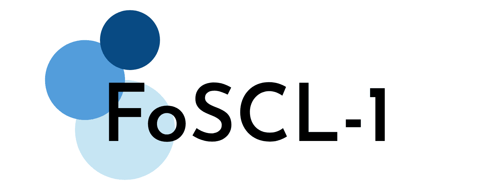

# FoSCL 簡介

## 1. 簡介

第一屆嶺南語言討論會（FoSCL-1）由嶺南粵音泛粵典編委會主辦。討論會基本情況如下：

- 日期：2021 年 7 月 31 日（星期六）
- 時間：下午 14 時 30 分至下午 17 時 15 分
- 場所：線上 Zoom 會議

## 2. 目標

我哋希望：

1. 每年喺定期舉行嘅「[泛粵線下交流會](/pan-cantonese-offline-meeting/)」前後進行年度性嘅學術分享與討論，爲嶺南粵音提供相對正式嘅學術交流平臺；
2. 通過定期交流，孵化更多成果；
3. 通過呢個平臺，展現出非官科組織嘅力量。

## 3. 報告形式

本次討論會採用圓桌會議嘅報告形式，每場報告長唔超過 30 分鐘。以 30 分鐘爲例，分爲兩部分：前 5 分鐘進行簡述同概要說明；後 25 分鐘進行內容嘅詳細闡釋，中途聽眾可以隨時提問、評論。

## 4. 相關文件

[程序表及論文摘要](https://www.kdocs.cn/l/slahUgt0tY2K)
