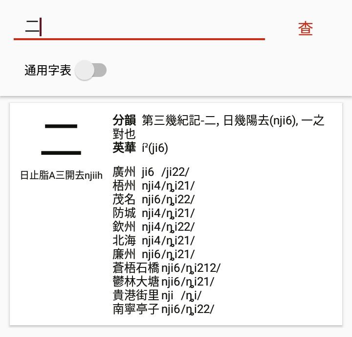
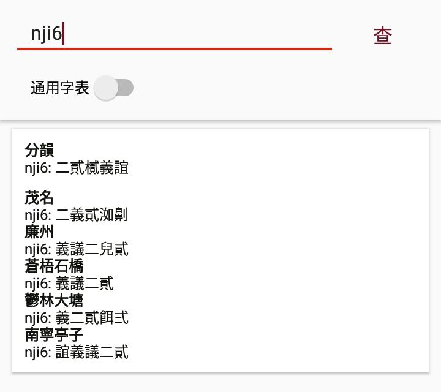
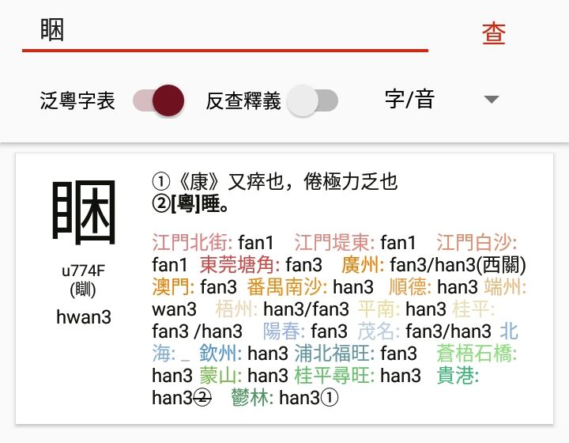
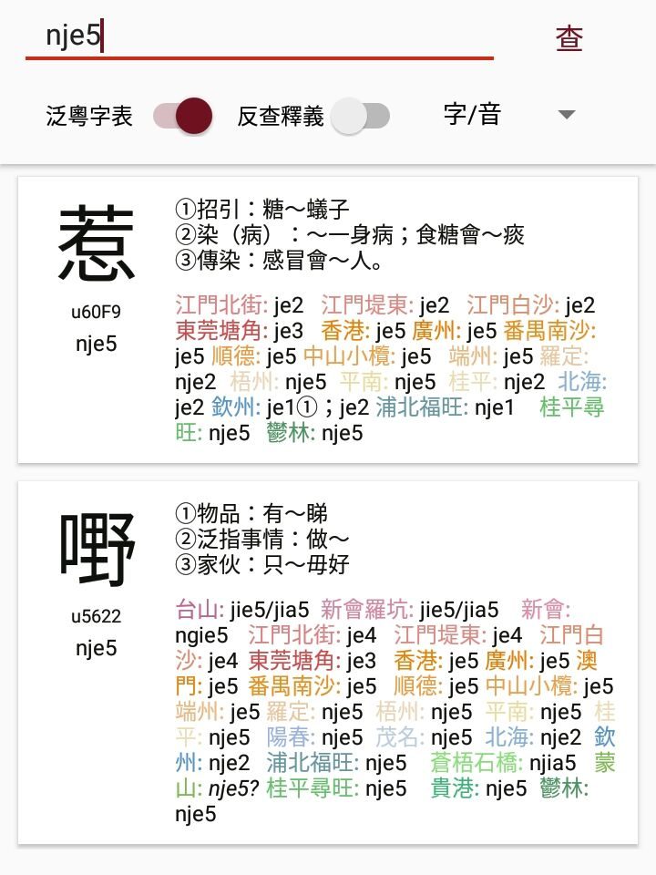
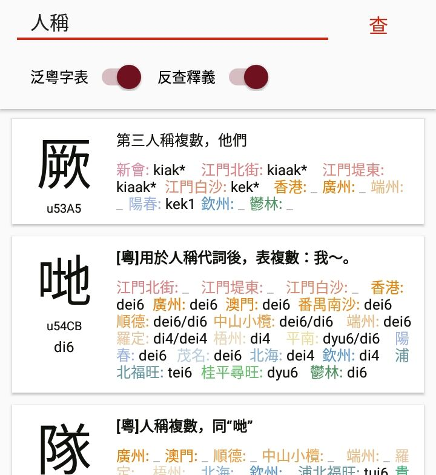

# 泛粵典安卓版

當前版本：0.5.0

本安卓應用爲[開源項目](https://github.com/JyutdictEB/Jyutdict-Android)，歡迎 issue 及 star。

**下載地址**

- [藍奏雲](https://wwa.lanzoui.com/b010whhbe)（提取碼：7xg7）

- [百度網盤](https://pan.baidu.com/s/1r7mo35tEwZ0zAjQHIacf8w)（提取碼：djms）

- [天翼雲盤](https://cloud.189.cn/t/yA7FVnUzQZj2)

- [GitHub Releases](https://github.com/JyutdictEB/Jyutdict-Android/releases)

以下係「泛粵典安卓版」嘅介紹。

## 1. 泛粵典

泛粵典旨在收集現時各地讀音、歷史韻書地位及擬音，同時提供咗啲基本查詢功能，包括查字、查音。未來再繼續加入查韻（按音韻地位檢索）及查詞等功能同埋更多字表。

本應用爲泛粵典嘅安卓終端版本。由於服務器嘅數據仍然不斷更新緊，且有啲數據未得到原作者授予完全公佈嘅權限，故此，本應用暫仍需使用網絡向服務器查詢。而服務器唔喺境內，查詢或顯遲鈍，望見諒。

此外，受限於本應用嘅受眾定位，若果接觸粵語音韻知識較少嘅人（有如尋求學習粵語途徑者），**本應用可能會顯得不甚友好**。

## 2. 通用字表與泛粵字表

**本應用粵語拼音方案使用[擴展粵拼](/j++/)**（下簡稱 J++），調號方案大多見於[泛粵聲調表](https://www.jyutdict.org/about#tone)。

**通用字表（或稱「通語字表」）**，收集嘅係粵官共有，或使用範圍較廣嘅字。

相比小學堂，此處各地字表、韻書數據都係由嶺南粵音群內各地學者提供（詳見本文底部名單），由此地方音基本上都係佢哋經過自我審查、去除猩化讀音後嘅當地音。

爲咗方便對比，字頭下低跗注咗[《廣韻》地位信息](https://ytenx.org/kyonh/)以及 [Polyhedron 嘅中古拼音](http://zh.wikipedia.org/wiki/User:Polyhedron/中古漢語拼音)，其表示方法同[「漢字古今中外讀音查詢」App](https://zhuanlan.zhihu.com/p/20839947)。

其中，字項右上角部分顯示嘅係韻書音，「分韻」代表[《分韻撮要》（尺牘版）](https://ytenx.org/pyonh/)，「英華」代表[《英華分韻撮要》](https://zh.wikipedia.org/wiki/英華分韻撮要)

地方音表格地方名稱後爲 J++ 及相應嘅 [IPA](https://en.wikipedia.org/wiki/International_Phonetic_Alphabet)記音。偶有第四列作爲備註，通常係對多音字嘅例詞或說明。

查詢通用字表時可以同時檢索多個漢字，支持自動簡轉繁。但需要注意不可同時檢索多於十個漢字，且對兼容字支持不佳。

亦可以使用 J++ 來查詢各地嘅同音字，此時直接輸入讀音並查詢即可。

調號可以省略代表「聲調不敏感」。

------

**泛粵字表收錄泛粵粵語中相較普通話更有「粵語特色」嘅字**，並使用[擴展粵拼（J++）](/j++/)記錄該字喺各點中嘅讀音。截至 2021 年 2 月，表內已收錄三千餘項。

雖然字表釋義可能兼顧唔到多地用法，各地嘅記錄亦都可能受限於編者知識而未夠精準，但起碼可以將呢啲特色字不分地位噉數位化記錄保存，同時可大致確定某字某義嘅使用範圍。反之，各地字音亦都可以提供畀字頭更精細嘅音韻地位信息。

上圖係喺「泛粵字表」中查詢「睏」嘅結果。左側從上到下依次爲**錔字**、統一碼、其他字形（如民間俗字、僞本字）、**綜合音**。實際展示嘅順序可能與此處說明有異。

- **「錔字」唔代表本字或正字**，而只係基於音、義來揀出嘅相對合理嘅字，因此既不過分追求本字，不抵制使用口字旁俗字，亦不強求作爲日常打字使用。

- **「綜合音」唔代表正音**，亦唔代表歷史讀音，而係融合各選點最高舉處而成嘅人工音系。「綜合音」有時難免會有誤標嘅情況，故還請多多參照後邊各方言點標註嘅讀音。

由此，**本應用不持有任何「正音」或「正字」嘅立場**。

右側分爲「釋義」、「各地讀音」、「語義場」三部分：

- **當「釋義」有粗體字時，應僅關注粗體部分**，其它義項通常取自當前字頭嘅古字典釋義或通語解釋，而唔代表某地有呢啲意義。

- 「各地讀音」部分默認會對各地點著色，著色參數可于設置界面調整。其中顏色越相近、兩地差異越小，色相可認爲係該點嘅分片歸屬；讀音部分同樣使用 J++ 標示，若帶有斜體問號「*?*」則表示當前讀音不確定，若有下劃線「_」則表示該方言點無此說法。

- 「語義場」指明該字含義嘅分類，僅部分字會用到。

與通用字表唔同嘅係，此處暫時一次只能檢索一個漢字，且不再支持自動簡轉繁。

同樣，可以使用 J++ 查詢綜合音，或者喺下拉列表指定以某一地嘅讀音來查詢。

**注意，請勿將「綜合音」等同廣州音/香港音**，綜合音嘅制定依據如下：

> **聲母：**
>
> z c s / zh ch sh：分韻精照（精 i 相容師韻 ii，故唔再標）
>
> j / nj：分韻日母
>
> **韻母：**
>
> aa / ae / e / i：ae 儘量表示二等，視乎順德等埞有冇高化；e 陰聲韻儘量表示蟹同埋支白，i / e 陽（入）聲韻見後
>
> o / oe：oe 除咗音系表示果三合之外，亦表示果開白讀，視乎具體文白
>
> ui / ooi / yi / yu：分韻魁（ui）雖（ooi）諸（yu）韻，切要裂化精組遇（yi）視乎各埞有冇裂化
>
> im in ing / em en eng：三四等文白，儘量照顧白讀，亦考慮各方音文白比例（入聲韻同理）
>
> ing / yng：梗曾三四等，視乎鬱林等埞有冇圓脣（入聲韻同理）
>
> ong / owng：宕江，視乎鬱林等埞有冇圓脣（入聲韻同理）
>
> **聲調：**
>
> 入聲 4 / 6：上下陽入，視乎元音長短，主要參照鬱林

因爲各地音係由各地母語者自行填寫，而當前人手並不多，故常有某地填寫未完整或出錯嘅情況。有心協助者可通過本頁面底部嘅聯繫方式聯繫我哋。

除此之外，仲可以「反查釋義」。

由於技術等原因，反查釋義會同時匹配到例詞等位置，同時每次檢索嘅最大結果顯示量限制爲 50，因此需自行選擇合適嘅關鍵詞。

無論使用何種查詢方法，只要字項有一個字頭，就可以通過短按或長按來複製該字。

另註：以上截圖均爲歷史版本，較新版本佈局或有差異。

## 3. 資料來源

（均不分先後，帶@號爲知乎名稱）

### 3.1 通用字表來源

簡繁異轉換字表來自 [OpenCC](https://github.com/BYVoid/OpenCC)

中古音（廣韻）：[@王赟 Maigo](https://www.zhihu.com/people/maigo)《漢語古今中外讀音查詢》入邊 poem 嘅《廣韻字音表》

分韻、英華：[@大渡河飞过海](https://www.zhihu.com/people/da-du-he-fei-guo-hai) 主導

開平沙塘：[@xing](https://www.zhihu.com/people/yin-li-chang-liang-80)

新會會城：[@Kwingiem Chan](https://www.zhihu.com/people/reseted1608208839617)

江門水南：[@Kwingiem Chan](https://www.zhihu.com/people/reseted1608208839617)

廣州　　：[@以成](https://www.zhihu.com/people/huang-jun-xin-74)

肇慶端州：[@Ecr-弋汐](https://www.zhihu.com/people/ecisrhetha)

梧州　　：[@大渡河飞过海](https://www.zhihu.com/people/da-du-he-fei-guo-hai)

茂名　　：潘少、[@Aleko Lau](https://www.zhihu.com/people/lau-alex)、常ならむ

防城　　：[@晴海喵鱼子](https://www.zhihu.com/people/recif-poisson)

欽州　　：[@Jzit](https://www.zhihu.com/people/lai-joengzit)

北海　　：[@Sin Yeung](https://www.zhihu.com/people/xian-yang-61)

廉州　　：《廣西通志·漢語方言志》+ 互聯網 + [@Sin Yeung](https://www.zhihu.com/people/xian-yang-61) 審查並校對

貴港街里：[@貴糖菠蘿](https://www.zhihu.com/people/teng-teng-64-96) 以及《貴港話同音字彙》（黃格凡）

桂平尋旺：[@馮景宸](https://www.zhihu.com/people/jing-meng-xing-cheng)

蒼梧石橋：[@大渡河飞过海](https://www.zhihu.com/people/da-du-he-fei-guo-hai)

容縣　　：PYT

鬱林大塘：[@暾明](https://www.zhihu.com/people/tun-ming-89)

### 3.2 泛粵字表來源/填寫人

台山　　：——

新會羅坑：——

新會　　：——

江門　　：[@Kwingiem Chan](https://www.zhihu.com/people/reseted1608208839617)

東莞塘角：《莞語探源》

香港　　：網絡；[@以成](https://www.zhihu.com/people/huang-jun-xin-74)、Henry；《香港粵語詞典》

廣州　　：William、[@以成](https://www.zhihu.com/people/huang-jun-xin-74)、[@Zenam](https://www.zhihu.com/people/zenam)；《實用廣州話分類詞典》、《廣州方言詞典》

澳門　　：[@日月盈昃](https://www.zhihu.com/people/siufeifeitunghok)

番禺南沙：傷城

順德　　：[@Uncle光](https://www.zhihu.com/people/zuo-yao-20)

中山小欖：[@靈帝](https://www.zhihu.com/people/ling-di-89)

端州　　：@Ecr.弋夕希霅/[@Ecr-弋汐](https://www.zhihu.com/people/ecisrhetha)

鼎湖　　：[@莫嚳](https://www.zhihu.com/people/mo-ku-89)

羅定　　：阿斯巴甜

梧州　　：[@大渡河飞过海](https://www.zhihu.com/people/da-du-he-fei-guo-hai)、金網漸遠綫

平南　　：[@topslut](https://www.zhihu.com/people/topslut)

桂平　　：何平

南寧　　：——

湛江　　：曇山

陽江　　：二尾

陽春　　：不羈

高州　　：

茂名　　：[@Aleko Lau](https://www.zhihu.com/people/lau-alex)

北海　　：[@Sin Yeung](https://www.zhihu.com/people/xian-yang-61)

欽州　　：[@Jzit](https://www.zhihu.com/people/lai-joengzit)、[@DiegoWong](https://www.zhihu.com/people/huang-zhao-qing-71)、潘叔、[@Sin Yeung](https://www.zhihu.com/people/xian-yang-61)

防城　　：[@晴海喵鱼子](https://www.zhihu.com/people/recif-poisson)

浦北福旺：小木

廉州　　：網絡

靈山　　：《靈山話紀略》

新立　　：《欽州新立話研究》

貴港　　：[@貴糖菠蘿](https://www.zhihu.com/people/teng-teng-64-96)

桂平尋旺：[@馮景宸](https://www.zhihu.com/people/jing-meng-xing-cheng)

梧州戎墟：類光源、[@大渡河飞过海](https://www.zhihu.com/people/da-du-he-fei-guo-hai) 錄入

蒼梧石橋：淩蕓、[@大渡河飞过海](https://www.zhihu.com/people/da-du-he-fei-guo-hai) 錄入

蒙山　　：某份蒙山字表 + [@大渡河飞过海](https://www.zhihu.com/people/da-du-he-fei-guo-hai) 錄入

鬱林　　：[@暾明](https://www.zhihu.com/people/tun-ming-89)

## 4. 聯繫方式

若有心編寫通用字表或協助泛粵字表項目，且對音韻學有一定了解（應至少需要懂得多少粵拼及對自家母語嘅歸納能力），歡迎通過以下方式聯繫：

[嶺南粵音 Bilibili 平臺](https://space.bilibili.com/410568594)私信

泛粵典反饋組（QQ 羣）：837607356

開發者個人QQ：526438991

開發者個人知乎：@Ecr.弋夕希霅（舊）/ [@Ecr-弋汐](https://www.zhihu.com/people/ecisrhetha)（現）

## 5. 隱私聲明

喺使用本應用時，服務器後臺將記錄且僅記錄包括 IP 地址及查詢時間在內嘅查詢內容。呢啲資料僅用於優化服務器，及規避諸如受惡意攻擊一類嘅風險，而唔會用於識別特定個人。

[泛粵典 IT 工作組](https://github.com/JyutdictEB)唔會將呢啲資料嘅任何部分以任何方式提供至除開發組以外嘅第三方。

本應用僅使用嘅權限爲：寫入剪貼簿（以複製字頭等），訪問網絡（以向服務器查詢）。
